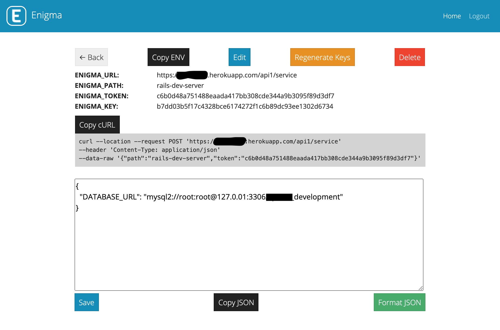

#  nigma
Enigma is a lightweight nodeJS application to store environment variable securely and transfer though API. Very useful to update, pass to ECS and easy to manage. You can also run it to aws:lambda for production preferred and heroku for testing/sandbox env.



```curl
curl --location --request POST 'https://<host>/api1/service' \
--header 'Content-Type: application/json' \
--data-raw '{
    "token": "432320bb5bea597ec4cb901870f4bc97b3d6ca8afbf898ef785772820ee7bb8e",
    "path": "node-ecs-dev-server"
}'
```

## Encryption technique
`AES-256-CBC` which require `iv:16` and `key:32` which include as complete encryption key as first 16 chars are `iv` and rest 32 chars are `enc_key`.

Generate key using `adonis enc_key_gen`, like `Key: e8768e43c7a6047ebf3c199c2470cb477d907b1e0917c17b`. Key has 48 chars where first 16chars are iv as `e8768e43c7a6047e` and rest 32 chars are encryption key as `bf3c199c2470cb477d907b1e0917c17b`.

```js
// NodeJS
const crypto = require('crypto');

const iv = 'e8768e43c7a6047e'
const enc_key = 'bf3c199c2470cb477d907b1e0917c17b'
const plain_text = '{"hello":"world"}'
const encrypted_text = 'l/w30rTVW1xu1Mq2K+jvPATSbWspWKqDtEFHyLPaiY8='

var encrypt = ((plain) => {
  let cipher = crypto.createCipheriv('aes-256-cbc', enc_key, iv);
  let encrypted = cipher.update(plain, 'utf8', 'base64');
  encrypted += cipher.final('base64');
  return encrypted;
});

var decrypt = ((encrypted) => {
  let decipher = crypto.createDecipheriv('aes-256-cbc', enc_key, iv);
  let decrypted = decipher.update(encrypted, 'base64', 'utf8');
  return (decrypted + decipher.final('utf8'));
});

const encrypted_key = encrypt(plain_text);
console.log(encrypted_key)
const original_text = decrypt(encrypted_text);
console.log(original_text)
```

```ruby
# Ruby / Rails
require 'openssl'
require 'base64'

iv = 'e8768e43c7a6047e'
key = 'bf3c199c2470cb477d907b1e0917c17b'
plain_text = '{"hello":"world"}'
encrypted_text = 'l/w30rTVW1xu1Mq2K+jvPATSbWspWKqDtEFHyLPaiY8='

cipher = OpenSSL::Cipher::AES.new(256, :CBC)
cipher.encrypt
cipher.key = key
cipher.iv = iv
text = cipher.update(plain_text) + cipher.final
final = Base64.strict_encode64(text)
puts final

decipher = OpenSSL::Cipher::AES.new(256, :CBC)
decipher.decrypt
decipher.iv = iv
decipher.key = key
dplain = decipher.update(Base64.strict_decode64(encrypted_text)) + decipher.final
puts dplain
```

### Rails Integration
1. Make file at `config/enigma.rb`

```ruby
# config/enigma.rb

begin
  unless ENV['ENIGMA_PATH'].present? && ENV['ENIGMA_TOKEN'].present? && ENV['ENIGMA_URL'].present? && ENV['ENIGMA_KEY'].present?
    puts 'ENIGMA SKIPPED'
    return
  end
  params = { path: ENV['ENIGMA_PATH'], token: ENV['ENIGMA_TOKEN'] }.to_json
  resp = Faraday.post(ENV['ENIGMA_URL'], params, "Content-Type" => "application/json")
  encrypted = JSON.parse(resp.body)["value"]

  enigma_key = ENV['ENIGMA_KEY']
  iv = enigma_key[0...16]
  key = enigma_key[16..-1]

  decipher = OpenSSL::Cipher::AES.new(256, :CBC)
  decipher.decrypt
  decipher.iv = iv
  decipher.key = key
  plain = decipher.update(Base64.strict_decode64(encrypted)) + decipher.final

  envs = JSON.parse(plain)
  envs.each do |key, value|
    ENV[key] = value
  end
  puts "Enigma setup completed"
rescue => e
  puts "Enigma setup failed: " + e.message
end
```

2. Create enigma enable at `config/application.rb` as:
```ruby
#config/application.rb

require_relative 'boot'

require 'rails/all'

# Require the gems listed in Gemfile, including any gems
# you've limited to :test, :development, or :production.
Bundler.require(*Rails.groups)

############################
require_relative 'enigma'
############################

module RailsApp
  class Application < Rails::Application
    # Initialize configuration defaults for originally generated Rails version.
    config.load_defaults 6.0

    # Settings in config/environments/* take precedence over those specified here.
    # Application configuration can go into files in config/initializers
    # -- all .rb files in that directory are automatically loaded after loading
    # the framework and any gems in your application.
  end
end
```

[see more code references at gist](https://gist.github.com/dayitv89/0db2bb1468108b07a7b7fdc38b27964b)

##### Under MIT License
